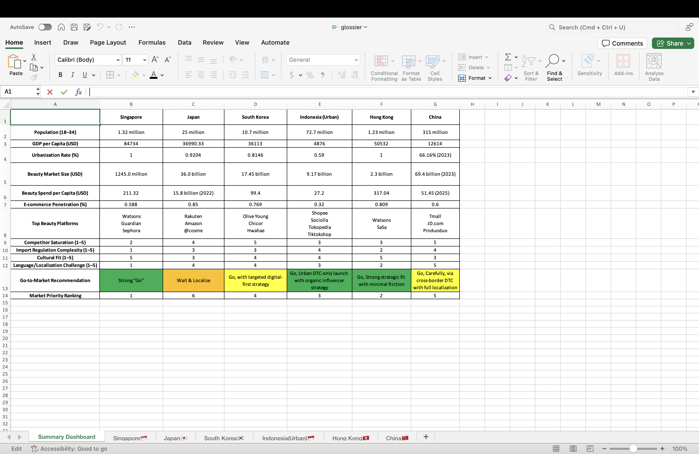

# glossier-asia-market-entry
Market feasibility analysis for Glossier’s expansion into Asia using Excel dashboards and go-to-market strategy scoring.
# Glossier Asia Market Entry Dashboard

This project simulates a strategic market entry analysis for Glossier — a direct-to-consumer (DTC) beauty brand — expanding into six Asian markets: Singapore, Japan, South Korea, Indonesia (Urban), Hong Kong, and China.

## Objective

To evaluate the feasibility and attractiveness of each market based on both quantitative data and qualitative strategic fit, and to propose go-to-market recommendations tailored to Glossier’s brand identity and DTC business model.

## Key Features

- Excel dashboard comparing country-level metrics:
  - Population aged 18–34
  - GDP per capita (USD)
  - Urbanization rate
  - Beauty market size and spend per capita
  - E-commerce penetration
  - Top beauty platforms

- Subjective scoring system for:
  - Competitor saturation (1–5)
  - Import regulation complexity (1–5)
  - Cultural fit (1–5)
  - Language and localization challenge (1–5)

- Color-coded go-to-market recommendations:
  - Strong "Go"
  - Go with caution
  - Wait and localize

- Market priority ranking to determine expansion sequencing

## Summary of Recommendations

| Country           | Recommendation                                 | Rank |
|------------------|--------------------------------------------------|------|
| Singapore         | Strong "Go"                                     | 1    |
| Hong Kong         | Go – Strategic fit with minimal friction        | 2    |
| Indonesia (Urban) | Go – Urban DTC launch with organic strategy     | 3    |
| South Korea       | Go – With targeted digital-first approach       | 4    |
| China             | Go – Carefully via CBEC with full localization  | 5    |
| Japan             | Wait and localize                               | 6    |

## Data Sources

- Statista
- DataReportal
- World Bank
- ECDB (eCommerceDB)
- SimilarWeb

## Tools Used

- Microsoft Excel (dashboard structure, scoring system, cross-sheet formulas)
- Public market research
- Strategic analysis methods inspired by consulting-style frameworks

## Author

Coco Ho Zee Yee
Business and Data Analytics Undergraduate, Singapore Management University  
LinkedIn: www.linkedin.com/in/coco-ho-b41ba024b

## Dashboard Preview

